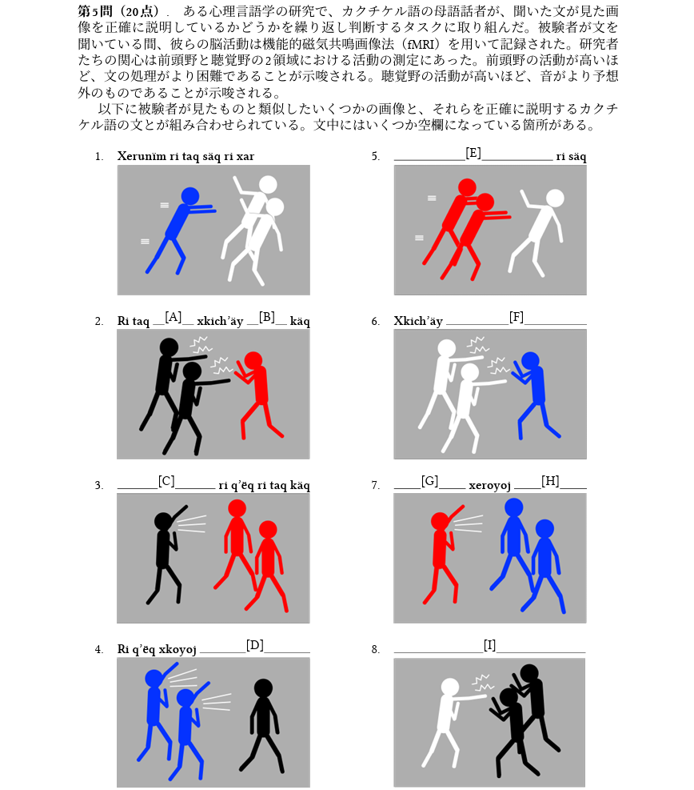
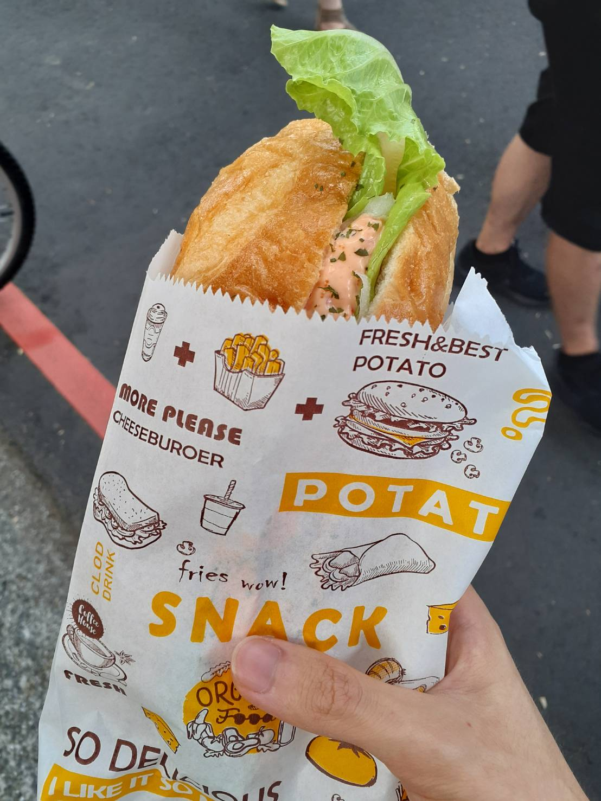
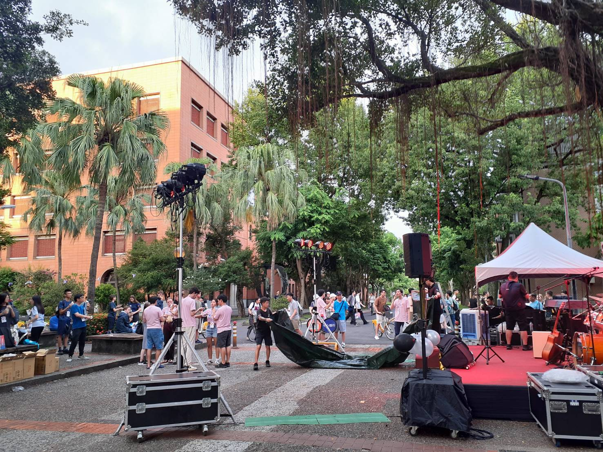
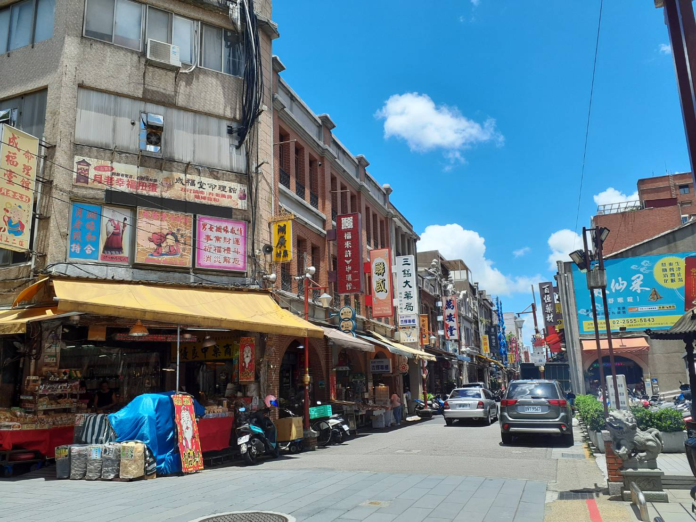
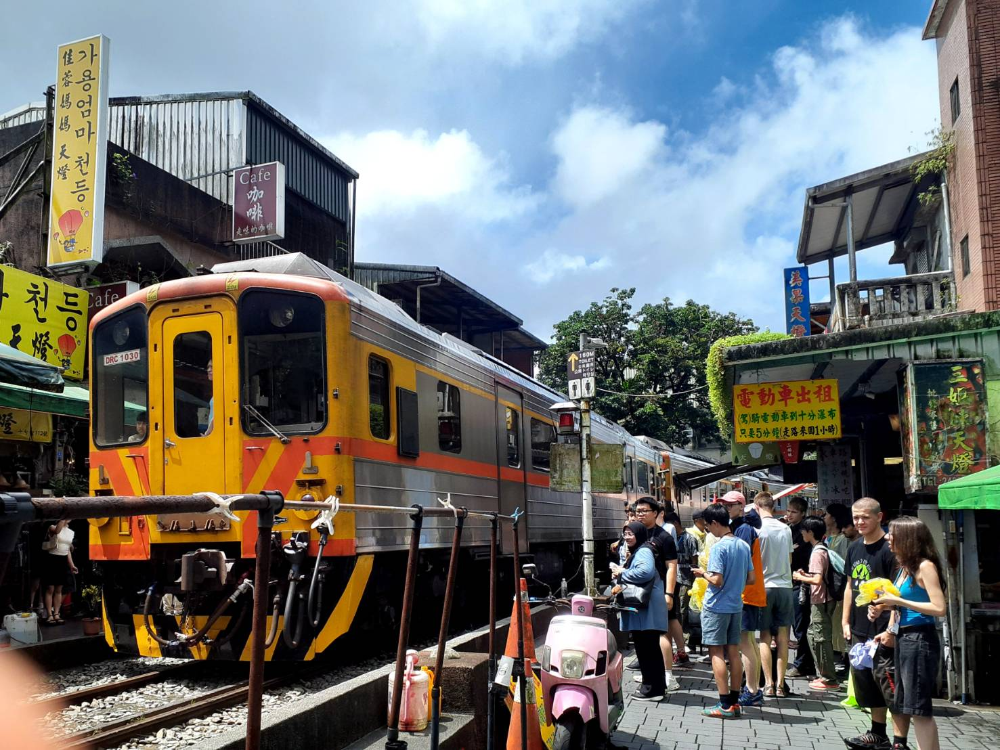
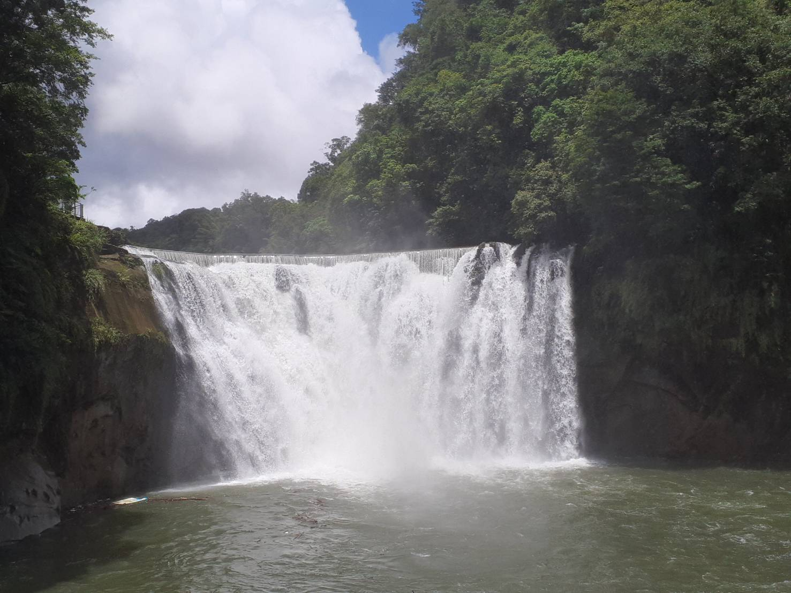
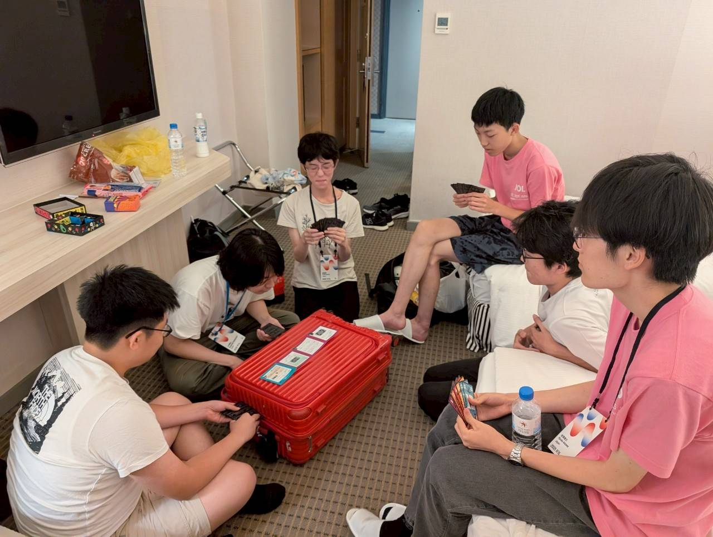
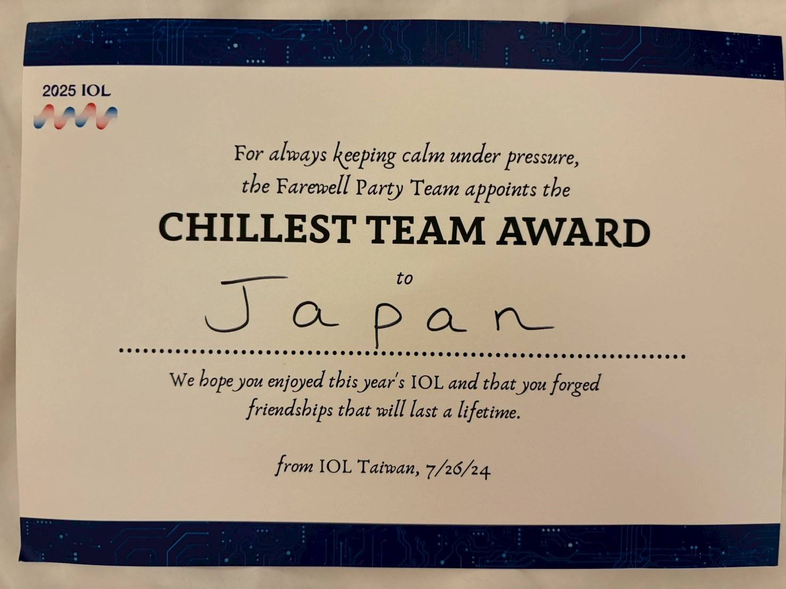

+++
title = "体験談"
type = "page"
+++

[←その他の体験談](/experiences/)

この体験談はIOL2025代表の相澤さんが書いてくれました．

2025年

## 国際大会体験談

2025年台湾大会の代表です。私は高校1年の冬のJOL(国内大会)に初めて出場し、高校3年の夏にIOL(世界大会)に参加しました。ここでは、高2の冬のJOLから高3の夏のIOLまでの様子を記していきます。

### 日本言語学オリンピック（JOL）

事前にやったこと：過去問の演習

過去問の演習、と書きましたが、それほど量をこなしたわけではなく、JOLの過去5年分くらいを解きました。結果は金賞のボーダー点。危なかったです。
このオリンピックは（少なくともJOLの段階では）知識がほぼなくても解けるという点で、一度挑戦してみる価値が高いと思います。

### アジア太平洋言語学オリンピック（APLO）

事前にやったこと：過去問の演習

「ことはじ」という過去問のデータベースを活用してAPLOの過去問を解きました。最近は更新が止まっていることもあるようですが、それでも使い勝手が良いのでおすすめです。
結局それほど演習量をこなせませんでしたが、本番で予想以上に高得点をとることができて嬉しかったです。

### 国際言語学オリンピック（IOL）

事前にやったこと

**①過去問の演習**

問題との相性が結果を大きく左右するとはいえ、過去問を解くことで得られる経験値は非常に大切です。私は受験勉強もあり、本番2週間前頃からしか本格的に演習できませんでしたが、とにかく色々解いてみるのが良いと思います。（言語学の問題は解いていて楽しい）
代表の中には「IOLの過去問は全部解いた」という人もいました。すごい。

**②オンライン練習会（個人戦に向けて）**

言語学オリンピック出場経験のある先輩方や、言語学の専門の方が過去問の解説をしてくださいました。平日の夜にオンラインで実施されることが多かったです。私は平日は毎日塾があったのであまり参加できませんでしたが、「解説書」みたいなものが充実していない分、こうした解説はとても貴重でありがたかったです。

**③練習会（団体戦に向けて）**

3週間に1回ほど対面で団体戦の問題を解きました。初回の練習会に行ったら、現地に代表が私しかおらず非常に不安だった記憶があります。居住地の関係で現地に来られない人の中にはオンラインで参加している人もいました。最初は初対面でお互い緊張していたと思いますが、渡航前に代表と対面で会える貴重な機会でした。

**④渡航準備**

パスポートやお金の用意、そして体調管理も大事です。

#### 7/20：出発

関東組は成田空港、関西組は関西国際空港からそれぞれ台湾へ旅立ちました。空港には保護者の方が来ている代表もいました。いよいよ始まるオリンピックへのワクワク感と同時にかなり緊張していました。私は緊張するとご飯が食べられなくなるので、おにぎり2個とサラダだけで1時間くらい食べるのにかかりました。
そして、あっという間に台湾に着くと、意外と日本と雰囲気が似ていてほっとしました。漢字を見慣れている、ということも大きいのかもしれません。
ホテルに着くと、大会運営ボランティアの人と英語で会話しました。夜ごはんの弁当を支給する場所で「お腹空いてる？」と聞かれたのですが、正直に「あまり空いていない」と答えました。その後、関西組も到着したのですが、関西組はすでに結構打ち解けていてびっくりしました。関西人ってやっぱりコミュ力がすごいのかなー、なんて思いました。

#### 7/21：開会式

いよいよ開会式。各国の代表が次々に紹介されていきます。本当に世界各地から代表が集まっていることを実感し、「これがオリンピックか」と感じさせられました。午後は開催地台湾の方によるパフォーマンスが行われました。開会式が終わった後は日本代表で小籠包を食べに行きました。ただ言語学の問題を解くだけでなく、こうした代表内での食事はいい思い出になりました。

#### 7/22：個人戦

個人戦は6時間にわたり実施されました。昼ごはんには巨大なパンが支給され、その他にも各自で持ってきた軽食を持ち込むことができますが、結局集中していてほぼ何も食べずに終わりました。今年の問題は私の苦手とする「命数」、「意味・対応」の問題が計3問もあり、問題を開けた瞬間まずいと思いました。ただ、問題が簡単だったためある程度は解けたのでよかったです。解く際には「問題として出題しているということは何かこの言語特有の面白いことがある」と思って解くようにしました。そうすると、解いていくうちに「この言語、ここがおもしろいな」みたいなものが浮かび上がってきて、楽しかったです。特に第5問は解いていて一番楽しかったです。（2025問題：<https://ioling.org/booklets/iol-2025-indiv-prob.ja.pdf）>

個人戦後はWelcome Partyがありました。大学の敷地内の屋外で行われ、ステージでのパフォーマンスの鑑賞やキッチンカーでの食事の購入ができました。この時に海外の代表とも話して連絡先を交換できてよかったです。ある香港代表の方は、別の科学オリンピックでも国際大会に出場していてびっくりしました。（そして何より海外の人の英語力の高さには圧倒されました…）団体戦は残っていますが、個人戦が終わったということにほっとしていて、純粋にパーティーを楽しめました。日本代表のうち半分ほどはパーティーの途中でホテルに帰ってしまったのですが、残った人たちで勉強の話とか、男子校の話とか、他愛のないことをずっと話したのも楽しかったです。

#### 7/23：City Tour

この日は、ガイドの案内のもと台湾市内の観光をしました。日本の植民地時代の話もあり、歴史について考えさせられる機会になったと同時に、台湾の伝統や食事についても知ることができました。午後にはバッグにつけるストラップみたいなものも作って、日本に持ち帰りました。
夜には台湾で有名な夜市に行きました。平日でしたがすごい賑わいで、アツアツの胡椒餅を食べました。
しかし、この日は炎天下の中歩いたため非常に疲れました。

#### 7/24：Excursion

前日とは異なり、この日はバスに乗って遠くまで行きました。最初は十分に行き、ランタンに願いを込めて空に飛ばしました。IOL世界一への思いや、健康、受験合格などみんなの願いが叶うといいですね。

その後は「台湾のナイアガラ」と呼ばれる滝へ。横幅が今まで見た滝の中で一番大きく、遠くにいても飛んできた水で頭やメガネが濡れるほどの迫力でした。

昼ごはんは円卓を囲んで中華料理を堪能しました。個人戦が終わって緊張がほぐれていた上、たくさん歩いてお腹もすいており、とても美味しく感じられました。麻婆豆腐が一番だった気がします。
昼食後は九份へ移動。この頃にはだいぶ代表同士の仲もよくなってきて、天気は悪かったものの十分に楽しむことができました。
最後は猫村へ。猫はあまりいませんでした…
夕食は支給されたものではなく麺線と小籠包を食べに4人ほどで行きました。ホテルに残った残りの人たちは他国の代表と遊んでいたようで、それはそれで羨ましい。

#### 7/25：団体戦

前日はオリンピックから離れて観光をしていましたが、この日は真剣勝負。私はチームSamuraiでした。Samuraiは日曜日に何度か顔を合わせてチームで解く練習をしたので、きっと良い結果になると信じていました。
解いてみたら、難しい…分担云々ではなく、単純に実力不足であまり解けませんでした。今年は難しかったのだろう、と前を向こうとしましたが、思ったよりもう一方のチームNinjaは出来ていそうだったので、まずいなと思いました。やはり、オリンピックに来て何も賞をとらずに帰ることはできないというプレッシャーがあったので心配になってきました。
とはいえ、もうこれで競技は終了。夜は台湾の地元の店で魯肉飯を食べた後、部屋でみんなでカードゲームをしました。旅行先の夜更かしってほんとに楽しい！（そう思わせてくれた代表の仲間もありがとう）

#### 7/26：閉会式

閉会式では、各大問の解説が行われたのち、表彰が行われました。今年の日本代表は、個人では銀4、銅2、Honorable Mention1つ、団体ではHonorable Mention1つでした。一番自信のあった問題で結構間違っていたのが悔やまれるところではありますが、最初で最後のIOLでメダルをとれたことはよかったです。また、Samuraiは全員がメダルを獲得し、「ドリームチーム」になったらしいです。（これは翌日知ったことですが）日本では初めてのことのようなので嬉しいです。そうなるとなおさら団体で賞をとりたかったですが、十分満足できる結果でした。

↑日本チームはイベントに参加せずに地元の店に食べに行ってばかりいたからでしょうか。「Chillest team award」＝「一番チルしてたで賞(?)」に選ばれてしまいました。もらうべき賞なのかは分かりませんが、いい思い出になりました。

#### 7/27：帰国

楽しかった1週間も終わってしまい、ついに帰国します。1週間でずいぶん代表同士仲良くなれて嬉しかったです。言語学の問題を解く、という共通の趣味があったからこそあっという間に仲良くなれたのだと思います。
代表のみんなとの再会を願って、帰宅しました。

#### その後

言語学オリンピックがもう終わってしまった、もうIOLに選手として参加できない、そんなことを思ってばかりいて、なかなか溜まっている受験勉強に手が付けられませんでした。それだけ充実した1週間でした。

### 最後に

IOLを通じて様々な言語圏・文化圏の人との交流ができたこと、言語学という共通の趣味を持つ代表たちと参加できたことはかけがえのない思い出になりました。もうこれが最後のIOLかと思うと寂しくてなりませんが、日本代表のみんな、チームリーダーをはじめとする運営の方々には本当にお世話になりました。ありがとうございました！
